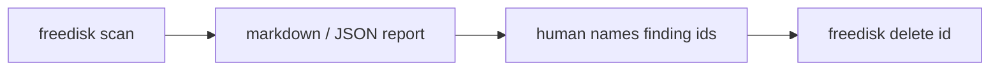

# freedisk

> Report what is eating disk on this Mac.
> Scan never deletes.

Agent-first disk **audit** CLI for macOS / APFS. It reports caches, tmp
children, sparse `Docker.raw` (allocated, not `ls` size), leftover
worktrees, `node_modules` / `target`, and simulators.

It is not a cleaner. It is not CleanMyMac. It is not
[Mole](https://github.com/tw93/mole). Nothing is removed unless a human
names finding ids and runs `freedisk delete`.

**0.1.0** · MIT · macOS / APFS only · Go 1.22+ ·
[`github.com/CiprianSpiridon/free-disk-space`](https://github.com/CiprianSpiridon/free-disk-space)

```
scan  →  report  →  human names ids  →  delete
```



---

## Safety

**Scan never deletes.** There is no mutate flag on scan. There is no
`delete --all`. Agents must not delete unless the human listed those ids.

| Rule | Detail |
| --- | --- |
| Only mutate path | `freedisk delete <id> [<id>…]` |
| TTY | type `yes` per id |
| Non-TTY | `--yes` required |
| Last scan | older than 24h is refused; re-scan first |
| Fullness | `diskutil apfs list` — **not** `df /` (sealed system snapshot) |
| Bytes | allocated (`st_blocks * 512`). Sparse `Docker.raw`: allocated, not apparent |
| Tmp | **children** only (`/private/tmp/kensi-*`). Never the tmp root |

**Refused on delete:** `keep` / `never`, git-tracked paths, in-flight
worktrees, busy npm / pnpm / yarn / cargo / uv / docker, tmp *roots*,
`/System`, `~/.cargo` as a whole, `/`, `$HOME`, whole Downloads /
Desktop / Documents / Library, `/Library/Developer`, `/opt/homebrew`,
iCloud Mobile Documents.

Print reclaim commands from the report. Do not run them unless those
delete ids were named.

---

## Install

macOS only. Install with Go. Homebrew tap is not published yet
([docs/homebrew.md](docs/homebrew.md)). No npm package.

From a checkout:

```bash
go install ./cmd/freedisk
ln -sfn "$(go env GOPATH)/bin/freedisk" "$HOME/bin/freedisk"   # optional if ~/bin is on PATH
freedisk version   # 0.1.0
```

From GitHub (once GOPROXY can see the module):

```bash
go install github.com/CiprianSpiridon/free-disk-space/cmd/freedisk@latest
```

Run without install:

```bash
go run ./cmd/freedisk help
go run ./cmd/freedisk scan --quick --json
```

Write the agent skill into every local CLI (Claude, Codex, Cursor, Grok, …):

```bash
freedisk skill install
```

---

## Use

```bash
freedisk help
freedisk scan --quick          # volume + catalog + home depth-1 + tmp
freedisk scan --dev            # + artifacts + worktrees + docker/brew APIs
freedisk scan                  # full (default): + drill + simctl + android
freedisk why                   # top reclaimable from last scan
freedisk delete <id> [--yes]   # only mutate path; human-named ids
freedisk catalog add PATH --scans quick,dev   # optional overlay
freedisk scans disable artifacts
```

JSON is default when stdout is not a TTY. Prefer `--json` when piping.
Progress is on **stderr** (`freedisk: phase …`, `still walking …`).
`--quiet` silences it. Do not kill a scan that is still printing those
lines.

No overlay is required. The bundled catalog already covers known caches,
SDKs, tmp, Desktop/Downloads, generic work roots, and auto-discovered
project folders.

### Scan time (full developer Mac)

| Mode | What | Typical | Budget |
| --- | --- | --- | --- |
| `--quick` | volume + known catalog + home/Library depth-1 + tmp children | 1–5 min | ~10 min if `$HOME` has a 100GB+ work dir |
| `--dev` | + leftover worktrees + `node_modules` / `target` / `.next` / venvs + docker/brew APIs | 3–10 min | — |
| default / full | + drill (~3 min cap) + simctl + Android | 5–15 min | drill never aborts the report |

Small disks: tens of seconds. Prefer `--quick` first.

### Reading a report

Markdown tables always include **id**, **path**, **last used**, and a
**command** (catalog owner cmd, or `rm -rf PATH`). The live report also
prints size and risk.

Never guess a path from a truncated id. JSON field `.path` is the real
path. Print commands; do not run them unless the human named those ids.

---

## Example

TTY `freedisk scan --quick` (abridged, fake rows):

```markdown
## Disk
- Container: 387.2 GiB in use / 62.4 GiB free (86%)
- Data volume: 381.0 GiB
- Note: df / disagrees (sealed snapshot)

## Reclaimable (high confidence)

| id | path | last used | command |
| --- | --- | --- | --- |
| `tmp-kensi-a1b2` | `/private/tmp/kensi-a1b2` | 2026-08-02 (36d) | `rm -rf /private/tmp/kensi-a1b2` |
| `npm-cache` | `/Users/you/.npm/_cacache` | 2026-08-15 (23d) | `npm cache clean --force` |
| `worktree-grok-old` | `/Users/you/.grok/worktrees/kensi-app` | 2026-07-20 (49d) | `rm -rf /Users/you/.grok/worktrees/kensi-app` |
```

Then, only if the human named those ids:

```bash
freedisk delete tmp-kensi-a1b2 npm-cache
```

---

## Humans

1. Install (or `go run ./cmd/freedisk` from a checkout).
2. `freedisk scan --quick` — wait while stderr still prints phases.
3. Read **Reclaimable** then **Ask first**. Keep rows are not reclaim targets.
4. Optional: `freedisk delete <id>` for ids **you** listed. Type `yes`.

Optional overlay (not required for a useful scan):

```bash
freedisk catalog add PATH --scans quick,dev
freedisk catalog unassign PATH --from quick
freedisk scans disable artifacts
```

---

## Agents

Install the skill once (`freedisk skill install`), then:

```bash
freedisk scan --quick --json
freedisk why --json
```

| Do | Do not |
| --- | --- |
| Prefer `--json`. Progress is stderr-only so stdout stays parseable. | Kill a scan still printing `freedisk: phase` / `still walking`. |
| Start with `--quick`. Run `--dev` for artifacts/worktrees; full for simulators. | Invent a path from a truncated id. Use `.path`. |
| Print reclaim commands from the report. | Run `delete` unless the human named those exact ids. |
| Honor the time budgets above. | Call `delete --all` (it does not exist). Non-TTY delete without `--yes` fails. |

### Agents MUST update the catalog on this Mac

You **are allowed and expected** to change the per-user overlay after a
scan. The bundled catalog is generic; this computer is not. Overlay is
**not** delete. Never edit `catalog/macos-hotspots.yaml`.

```bash
freedisk catalog path                          # ~/.config/freedisk/catalog.yaml
freedisk catalog add PATH --scans quick,dev --risk ask --category user
freedisk catalog unassign PATH --from quick
freedisk catalog disable PATH
freedisk catalog list --json
```

Add when the user names a path, or home depth-1 / Ask-first showed a large
dir that should be sized every later scan. Unassign/disable when they do
not use that path. Re-scan after changes.

Exit codes: `0` report, `2` usage, `3` unknown id.

Last scan lives at `$XDG_CACHE_HOME/freedisk/last-scan.json` (else
`~/.cache/freedisk/last-scan.json`). `why` and `delete` read that file.

---

## Developers of this repo

macOS + Go 1.22. Phase order lives in `internal/scan/run.go` (`recipeOrder`).
Do not invent a different one.

```bash
go test ./...
go run ./cmd/freedisk help
go run ./cmd/freedisk scan --quick --json
go install ./cmd/freedisk
```

Set `HOME` (and `XDG_CACHE_HOME`) to a temp dir in tests that call
`scan`. Do not walk the real home.

### Layout

| Path | What you change |
| --- | --- |
| `cmd/freedisk` | `main` only |
| `internal/cli` | flags, help, `scan` / `delete` / `catalog` / `skill` |
| `internal/scan` | phases (`Register` + `recipeOrder` in `run.go`) |
| `internal/catalog` | YAML load, overlay merge (`~/.config/freedisk/catalog.yaml`) |
| `internal/policy` | delete deny list — scan must not import this to mutate |
| `internal/size` | allocated bytes, `WalkDir`, no `os/exec` |
| `catalog/macos-hotspots.yaml` | bundled paths (`go:embed` via `catalog/embed.go`) |
| `findings.schema.json` | JSON contract; keep `internal/findings` in sync |
| `skills/freedisk/SKILL.md` | agent skill; `freedisk skill install` copies it |

### Add a known path

1. Append a row to `catalog/macos-hotspots.yaml` (existence skip, `~` ok).
2. Set `risk`, optional `reclaim`, `drill: true` if children should be named.
3. `go test ./internal/catalog ./internal/scan` — `starting_point_test` forbids machine-specific paths like `work_cip`.

Users can add paths without a rebuild: `freedisk catalog add PATH --scans quick,dev`.

### Add a scan phase

1. New file in `internal/scan` with `init() { Register(Phase{Name, Quick, Dev, Run}) }`.
2. Append the name to `recipeOrder` in `run.go` (and `builtinPhases` in `cli/scans.go`).
3. `Quick: true` → `--quick`. `Dev: true` → `--dev`. Default `scan` runs every registered phase.
4. Phase must not delete. Progress: `ctx.logf(...)` (stderr).
5. Tests with `t.TempDir()` catalogs; inject `exec` via package vars (`SimctlJSON`, `RustupList`, …).

Current order: volume → known → tmp → drill → toolchains → artifacts → worktrees → apple-sim → android-sim → apis.

---

MIT. macOS / APFS only. No sudo. No network.
